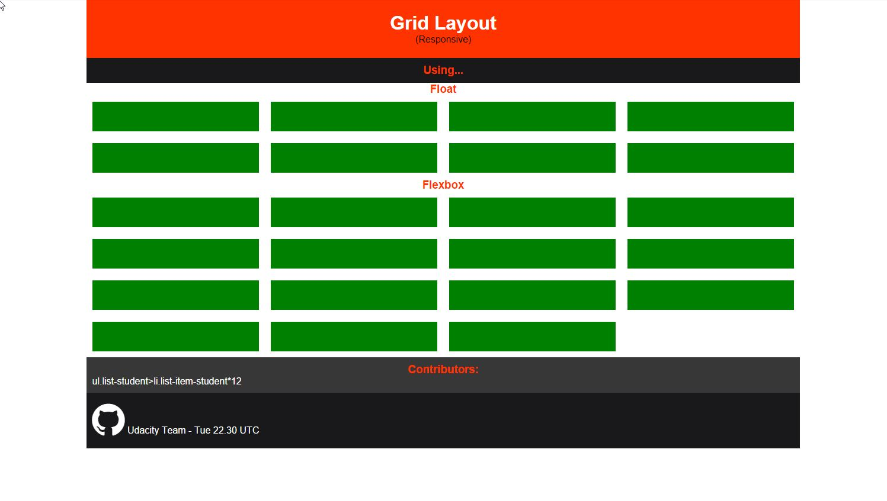

# Udacity Team / Front End Nanodegree / Sun 21.00 UTC / Resource Log
This repository keep records of useful resources from the team's weekly meetings.

## Week 02 (24 Oct 2015)
This week students and guide will together create *responsive grid layout* using different CSS techniques.
**In conclusion**, *flexbox* is the most semantic, powererful, easy-to-understand way to layout a web page.
(Other css layout techniques either need some sort of tweak / hack or using properties that doesn't
seem to relate.)

> Sorry that there's internet connection issue for some guys. Please raise the issue if you have trouble
understanding the content as well as solutions to resolve this communication difficulty.
Hopefully the session will get better soon for everyone

### Code Collaboration Session Result
- [Codepen (copied from JSFiddle collaboration session)](http://codepen.io/NKiD/pen/jbxOee)

Group will continue designing this web page next week by exploring different interesting CSS topics.
This will be helpful even for later projects, not just P1!

### What we discussed
1. Using ``calc()`` in CSS to calculate column width
2. Page and Grid Layout:
	- Float
	- Flexbox (new, powerful css layout mode)
	- ~~Inline-block~~
	- ~~Bootstrap CSS framework~~
	- ~~Table Display~~

3. Vertical Align Methods:
	- ``display:table`` and ``display: table-cell`` trick
	- ``line-height: trick``
	- Flexbox: easier to code and easier to read

### Reference / Responsive Grid Layout:
- [Easy Responsive CSS Grid Layouts: 4 Methods @SitePoint](http://www.sitepoint.com/easy-responsive-css-grid-layouts/)
	(See here for responsive grid layout using *table display*)
- [A Guide to Flexbox @Css-Tricks](https://css-tricks.com/snippets/css/a-guide-to-flexbox/)
- [Media Queries for Standard Devices @Css-Tricks](https://css-tricks.com/snippets/css/media-queries-for-standard-devices/)
- [Fighting the Space Between Inline Block Elements @Css-Tricks](https://css-tricks.com/fighting-the-space-between-inline-block-elements/)
	(If you're trying to layout using ``display: inline-block``)

### Reference / CSS properties used in source code
- [calc](https://developer.mozilla.org/en-US/docs/Web/CSS/calc)
- [float](https://developer.mozilla.org/en-US/docs/Web/CSS/float)
- [display](https://developer.mozilla.org/en-US/docs/Web/CSS/display)
- [line-height](https://css-tricks.com/almanac/properties/l/line-height/)

## Week 01
- Udacity's Support Channel:

- Sublime Text Editor package control: (for other editors, please google it's package manager or extension manager)
  - Package Control: https://packagecontrol.io/
  - Installing Package Control: https://www.youtube.com/watch?v=YvX8uwwJ5kg
  - Emmet - a very useful package to improve HTML & CSS coding work: http://emmet.io/
  - Emmet tutorial: https://www.youtube.com/watch?v=U4lFXtLF5Cs
  - Theming: https://www.youtube.com/watch?v=CWbZ6IVbHiY
