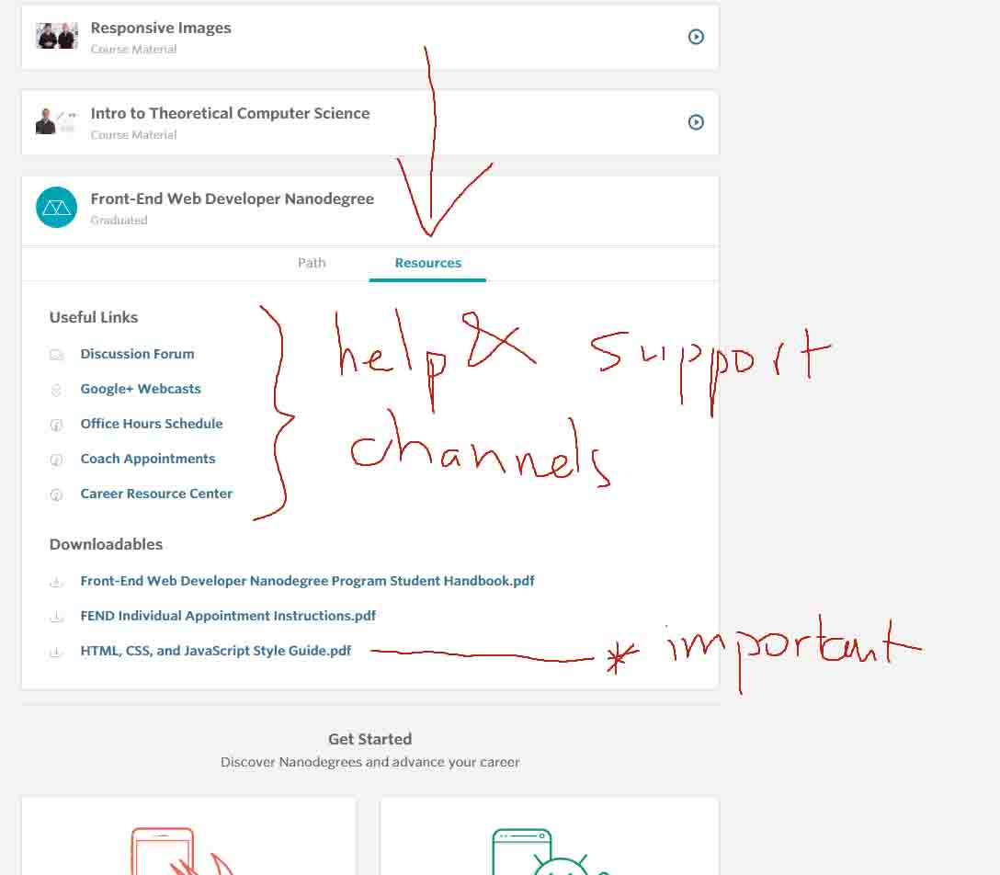

# Udacity Team / Front End Nanodegree / Sun 21.00 UTC / Resource Log
This repository keep records of useful resources from the team's weekly meetings.

## Week 01
- Udacity's Support Channel:

- Sublime Text Editor package control:
  - Package Control: https://packagecontrol.io/
  - Installing Package Control: https://www.youtube.com/watch?v=YvX8uwwJ5kg
  - Emmet - a very useful package to improve HTML & CSS coding work: http://emmet.io/
  - Emmet tutorial: https://www.youtube.com/watch?v=U4lFXtLF5Cs
  - Theming: https://www.youtube.com/watch?v=CWbZ6IVbHiY

## Week 02
